# 💫 About Me:
🚀 **Software Developer | Distributed Systems Enthusiast | Cloud & Low-Level Explorer**

I’m **Ajinkya Singh**, passionate about building **scalable backend systems**, **intuitive UIs**, and exploring **low-level system internals**. Currently pursuing my **B.Tech in Electronics & Communication Engineering at IIIT Nagpur**, I thrive at the intersection of **distributed systems**, **cloud infrastructure**, and **developer tools**.

## 🌐 Socials:
  

# 💻 Tech Stack:

### 📝 Languages & Runtimes

### 🖥️ Backend & Messaging  

### ☁️ Cloud & DevOps  

### 🛠️ Tools & APIs  

# 📊 GitHub Stats:

## 🏆 GitHub Trophies

### ✍️ Random Dev Quote

<!-- Proudly created with GPRM ( https://gprm.itsvg.in ) -->
